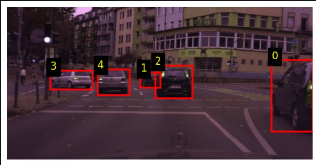

# Car Detection

Car Detection ML pipeline

## Description

This project composes a deep learning pipeline for multi-car detection in a given picture. It emphasises the understanding of the underlying detection model - **FasterRCNN**.

## Data

Data used for training and evaluation are not public, but were infered from public [City Scapes](https://www.cityscapes-dataset.com/) dataset.

## Data Exploration

Data exploration is performed in `src/notebooks/data_exploration`.

### Input Sample



## Usage

In the `src` folder

### Before anything

Make sure to have `uv` package manager installed on your device. To install necessary libaries to your environment, run:

```
uv sync
```

### Training

```
uv run python training.py <dataset_path>
```

### Inference

```
uv run python inference.py <dataset_path> model.pt 
```

### Evaluation

```
uv run python evaluation.py DET <dataset_path_bboxes> .\output_predictions\
```
